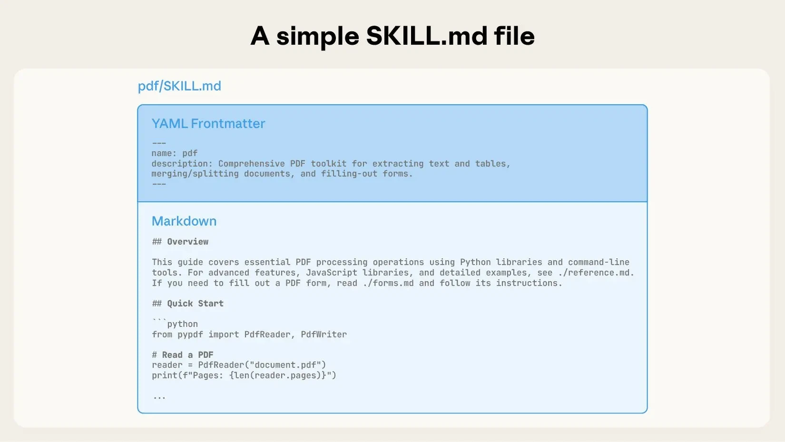
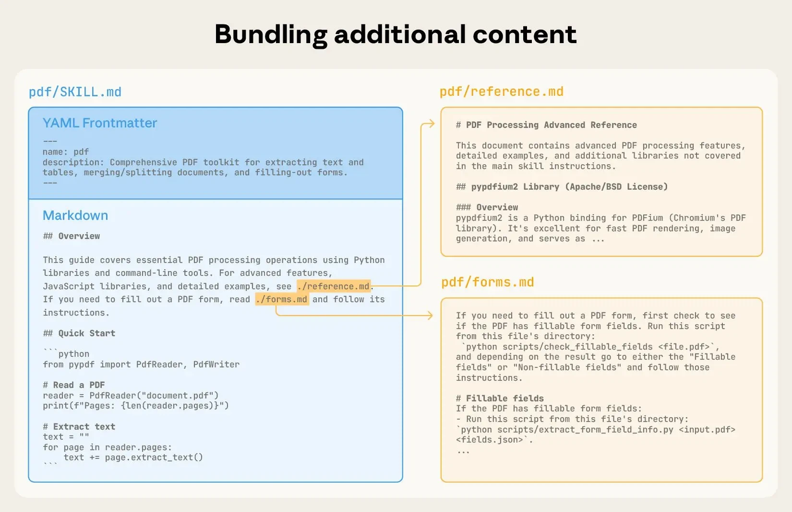
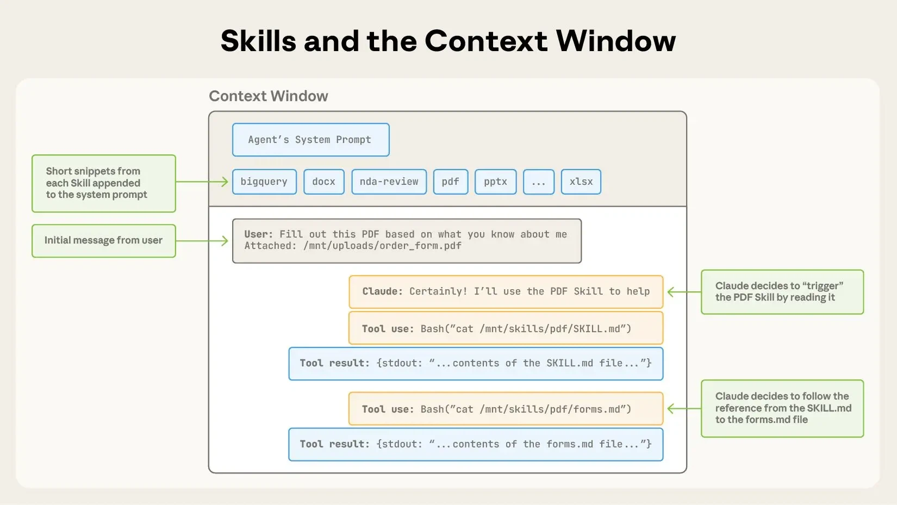
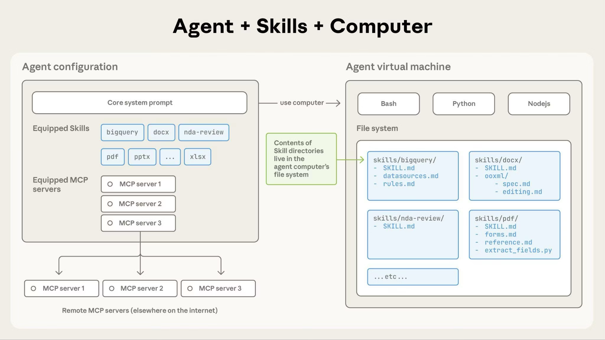

# 今巷で話題のAnthropicの『Agent Skills』とは

都内IT企業にてなんちゃってデータサイエンティスト/Pythonエンジニアをしています｡  
最近はグラフデータベースやGraphRAGの調査をしております｡  

先日[LINE DC Generative AI Meetup #7](https://linedevelopercommunity.connpass.com/event/371716/)に行ってきました!!    
とても刺激を受けたので初の投稿をしてみたいと思います｡


今､巷で話題となっているAnthropicから新しく発表された新機能｢Agent Skills｣について解説させていただきます!!  
(もうたくさん記事が出ていますが自分自身の勉強のためにも)

## 1. Agent Skillsとはそもそも何!?

Agent Skillsは、2025年10月17日にAnthropicから公開されたClaudeの新機能です。

### 基本的な概念

Agent Skillsとは、**AIに特定のタスクを教え込むための、手順書と道具箱をまとめたフォルダ**です。  
Claudeに専門的なタスクを実行させるためのパッケージとして機能します。

### 最大の特徴：モデル主導の起動

従来のシステムとの最大の違いは、**モデル主導の起動**にあります。  
ユーザーが明示的に命令しなくても、Claude自身が会話の流れから「このタスクには、あのスキルが役立ちそうだ」と判断し、自律的にスキルを呼び出して実行してくれます｡

## 2. MCP vs Agent Skills
### MCPによるコンテキストウィンドウの飽和について

MCPが直面する根本的な課題として、**コンテキストウィンドウの飽和**があります。  
※コンテキストウィンドウとはAIが一度に処理できるトークンの限界量です｡(Appendixに各社のコンテキストウィンドウを載せています)

### ツール増加による性能低下のジレンマ

AIエージェントの性能は接続される「ツール」の数や質に良い意味でも悪い意味でも大きく依存します｡

- **ツールが多い** → エージェントのできることは増える
- **ツールが多すぎる** → AIが「どのタスクに、どのツールを使えば最適なのか？」という判断に迷い始める

### MCPツールの具体的な問題

**コンテキストウィンドウの圧迫メカニズム：**

1. **起動時の情報読み込み**: AIエージェントは起動時に、利用可能なすべてのツールの定義（何ができるツールなのか、どう使うのか）をコンテキストウィンドウに読み込みます

2. **ツール数増加の影響**: ツールの数が増えれば増えるほど、この初期情報だけでコンテキストウィンドウが圧迫されます

3. **対話領域の縮小**: 結果として、ユーザーとの対話や思考に使える領域が狭くなってしまいます


### コンテキストウィンドウの重要性

AIエージェントが一度に扱える情報量=**コンテキストウィンドウ**は重要かつ有限なリソースです。  
  
ある環境では、MCPツールがコンテキストウィンドウの約30%以上を占めていた状況がありました。  

これらの課題を解決し、**ツールの多さ**と**性能の高さ**を両立させるために生まれたのが、**Agent Skills**という新しいアプローチです!!

### MCPとAgent Skillsの違い

最初は｢Agent SkillsはFunction Callingの一般化であるMCPと何が違うのか？」と思いました｡  
Agent Skillsは  
**MCPやツールといった個別の要素を、より上位の概念で『抽象化』し、パッケージ化する仕組み**  
と言えるそうです｡

| 項目 | MCP | Agent Skills |
| :--- | :--- | :--- |
| **役割** | AIエージェントに外部ツールを直接追加・拡張する仕組み | 複数のツールや手順、知識を一つの「スキル」としてパッケージ化する仕組み |
| **読み込み単位** | **全ての**ツールの定義 | **スキル名と簡単な説明**のみ。必要に応じて詳細を読み込む |
| **AIの負荷** | ツールが多いと、AIがどのツールを使うべきか「迷い」が生じ、性能が低下する可能性がある | 最初に読み込む情報が少ないためタスクへの集中力が高まる |
| **管理** | 類似ツールが増えると管理が複雑になり精度が落ちる | 関連するツールを一つのパッケージにまとめることでシンプルに管理可能 |

## 3. Agent Skillsの仕組み

### 段階的開示（Progressive Disclosure）

Agent Skillsの核心には、「Progressive Disclosure（段階的開示）」という設計思想があります。これは、情報を一度にすべて見せるのではなく、必要な情報だけを、必要なタイミングで段階的にAIに開示することで、コンテキストウィンドウを効率的に利用する仕組みです｡

従来のMCPツールでは、AIエージェントが起動時に利用可能なすべてのツールの定義を一度に読み込むため、ツール数が増えるとコンテキストウィンドウが圧迫され、性能が低下する問題がありました。Agent Skillsの段階的開示は、この問題を根本的に解決する革新的なアプローチです!!

### 3段階の読み込み戦略

#### レベル1：メタデータ（常に読み込まれる）

システムが起動した時に、各スキル(Skill.mdファイル)のスキルの名前（name）と簡単な説明（description）のメタデータが書かれた**YAMLフロントマター**のみが読み込まれ､システムプロンプトにセットされます｡
  
この段階では、Claudeは各スキルが「何ができるか」と「いつ使うべきか」という基本的な情報だけを把握します。  
1スキルあたりのトークン量は100程度と考えられており､仮に100個のスキルがインストールされていても合計で約10,000トークンしか消費せず、これは200,000トークンのコンテキストウィンドウのわずか5%です。

##### YAML Frontmatter（メタデータ部分）
```yaml
---
name: pdf
description: Comprehensive PDF toolkit for extracting text and tables, merging/splitting documents, and filling-out forms.
---
```



#### レベル2：指示（スキルがトリガーされたときに読み込まれる）

ユーザーのリクエストを分析し、特定のスキルが関連すると判断された時にSKILL.md本体の指示とガイダンスが読み込まれます。
通常3,000~5,000トークンが想定されます｡

この段階では、Claudeは具体的な作業手順、使用するツール、注意事項などの詳細な指示を受け取ります。

##### Markdown（本文部分）
````
**Overview**
This guide covers essential PDF processing operations using Python libraries and command-line tools. For advanced features, JavaScript libraries, and detailed examples, see ./reference.md. If you need to fill out a PDF form, read ./forms.md and follow its instructions.

**Quick Start**
```python
from pypdf import PdfReader, PdfWriter

# Read a PDF
reader = PdfReader("document.pdf")
print(f"Pages: {len(reader.pages)}")
```
````

#### レベル3：リソースとコード（必要に応じて読み込まれる）

SKILL.mdの内容だけでは不十分な場合、必要に応じて追加のマークダウンファイル、実行可能スクリプト、参照資料が読み込まれます。  
この段階では、実質的に無制限のトークンコスト（bash経由で実行されるため）で、より詳細な情報にアクセスできます。

##### ディレクトリ構成の例
```
pdf-skill/
├── SKILL.md (main instructions)
├── FORMS.md (form-filling guide)
├── REFERENCE.md (detailed API reference)
└── scripts/
    └── fill_form.py (utility script)
```



#### ※Claude がスキル コンテンツにアクセスする方法：
スキルがトリガーされると、Claude は bash を使用してファイルシステムから SKILL.md を読み込み、その指示をコンテキスト ウィンドウに取り込みます。  
これらの指示が他のファイル（FORMS.md やデータベース スキーマなど）を参照している場合、Claude は追加の bash コマンドを使用してそれらのファイルも読み込みます。  
指示が実行可能スクリプトについて言及している場合、Claude は bash 経由でそれらを実行し、出力のみを受け取ります（**スクリプト コード自体はコンテキストに入りません!!**）。

##### 実際の対話とskills呼び出しのイメージ
`Tool use: Bash("~")`でスクリプトコードはコンテキスト内に入っていない｡


### アーキテクチャの特徴

Agent Skillsのアーキテクチャには3つの重要な特徴があります。

#### ①ファイルシステムベース
Claudeは仮想マシン環境で動作し、ファイルシステムアクセスを備えたbashコマンドでスキルと対話します。これにより必要な情報だけを動的に読み込むことができます。

#### ②効率的なスクリプト実行
スクリプトのコードはコンテキストウィンドウに読み込まれず、スクリプトの出力のみがトークンを消費します。これによりコンテキストの無駄遣いを防ぐことができます。例えば、複雑なデータ処理スクリプトが1,000行のコードを持っていても、そのコードはコンテキストに含まれず、処理結果の「成功」や「エラー: ファイルが見つかりません」といった短いメッセージのみがトークンを消費します｡

#### ③バンドルコンテンツの制限なし
ファイルはアクセスされるまでコンテキストを消費しないため、包括的なAPIドキュメンテーション、大規模なデータセット、広範な例を含めることが可能です。使用されないバンドルコンテンツ(スキルフォルダ内に含まれるすべてのファイル群)に対するコンテキストの制約がありません。これにより、スキル開発者は「使うかもしれない」情報もskillsに含めることができます!!



## 4. 3つの実行環境について

Agent Skillsは、Claudeのエージェント製品全体で利用可能です。各環境で異なる機能と制限があります。

### Claude API
- **対応スキル**: 事前構築済みスキルとカスタムスキルの両方
- **使用方法**: `container`パラメーターで`skill_id`を指定

Claude APIでは、3つのベータヘッダー（`code-execution-2025-08-25`、`skills-2025-10-02`、`files-api-2025-04-14`）が必要です。カスタムスキルは組織全体で共有されるため、チーム開発に適しています。

### Claude Code
- **対応スキル**: カスタムスキルのみ
- **使用方法**: SKILL.mdファイルを含むディレクトリを作成（自動検出）

Claude Codeはファイルシステムベースのため、APIアップロードは不要で、ローカル環境での開発に最適です。ただし、事前構築済みスキルは利用できないため、すべてのスキルを独自で作成する必要があります。

### Claude.ai
- **対応スキル**: 事前構築済みスキルとカスタムスキルの両方
- **使用方法**: 事前構築済みスキルは自動機能、カスタムスキルは設定 > 機能からzipファイルでアップロード

事前構築済みスキルは、ドキュメント作成時に自動で機能するため、セットアップは不要です。カスタムスキルは、Pro、Max、Team、Enterpriseプランで利用可能で、各ユーザーに個別のものとして管理されます。

## 5. 具体的な活用例
### 想定される活用例

Agent Skillsは、Claudeを特定業務に適応させるための仕組みとして設計されており、フォルダ構成で知識やリソースをまとめるだけで、専門分野や部門ごとに異なるワークフローを再現できる点が強みです!!

#### 社内ナレッジベースの構築
企業の内部知識を体系的に整理し、従業員が簡単にアクセスできるナレッジベースを構築できます。各部署の業務マニュアル、技術仕様書、よくある質問集などをスキルとして整理することで、Claudeが適切な情報を瞬時に提供します。これにより、新入社員の教育コストを削減し、属人化した知識を組織全体で共有できるようになります。

#### 業務プロセスの自動化
定型的な業務プロセスをスキル化することで、大幅な効率化を実現できます。例えば、経理部門では「請求書処理スキル」を作成し、PDFの請求書からデータを自動抽出して会計システムに登録する作業を自動化できます。人事部門では「採用面接スキル」を用意し、応募者の履歴書を分析して適切な質問項目を提案するなど、様々な業務で活用可能です。

#### 開発チームの生産性向上
ソフトウェア開発において、プロジェクト固有の設定や手順をスキルとして標準化できます。API仕様書、デプロイ手順、テストケース、コードレビューガイドラインなどを一つのスキルにまとめることで、開発者が「この機能を実装するには？」と質問するだけで、プロジェクトに最適化された手順を即座に得られます。これにより、開発速度の向上と品質の標準化を同時に実現できます。

### Anthropicが公式で出しているskills

あらかじめ構築されたエージェントスキルは、ドキュメント作成、データ分析、ファイル処理といったタスクに関する専門知識を提供し、Claudeの機能を拡張します。Anthropicは、APIで以下のエージェントスキルを提供しています。

- **PowerPoint (pptx)**: プレゼンテーションの作成と編集
- **Excel (xlsx)**: スプレッドシートの作成と分析
- **Word (docx)**: 文書の作成と編集
- **PDF (pdf)**: PDF文書を生成する

これらの公式スキルは、一般的なオフィス業務で頻繁に使用されるファイル形式に対応しており、ユーザーは追加の設定なしで即座に利用を開始できます。各スキルは、そのファイル形式に特化した最適化された機能を提供し、高品質な出力を保証します。

## 参考リンク

- [やさしいClaude Skills入門](https://www.docswell.com/s/harinezumi/5M683X-2025-10-21-003933#p4)
- [Claude Agent SkillsのProgressive Disclosureとコンテキスト、そしてその配布について](https://kiririmode.hatenablog.jp/entry/20251020/1760938505)
- [Claudeを"育てる"新常識！ Agent Skills徹底解説 - あなたの仕事を自動化する魔法のレシピ ✨](https://note.com/kyutaro15/n/nfcc15522626f)
- [Agent Skills徹底解説！Claudeが【スキルを覚えるAI】へ進化！業務知識を丸ごと学習できる新時代へ](https://weel.co.jp/media/innovator/agent-skills/#index_id1)
- https://docs.claude.com/ja/docs/claude-code/skills
- https://docs.claude.com/ja/docs/agents-and-tools/agent-skills/overview
- https://docs.claude.com/en/docs/agents-and-tools/agent-skills/quickstart
- https://docs.claude.com/ja/docs/build-with-claude/context-windows
- https://docs.claude.com/ja/api/skills-guide
- [MCPツール棚卸しによるClaude Codeのコンテキスト最適化](https://zenn.dev/medley/articles/optimizing-claude-code-context-with-mcp-tool-audit)
- https://aws.amazon.com/jp/about-aws/whats-new/2025/08/anthropic-claude-sonnet-bedrock-expanded-context-window/
- [【完全解説】Claudeの新機能「Agent Skills」とは？MCPとの違いを徹底比較](https://note.com/masa_wunder/n/n9d524b7b840e)

## Appendix
### 主要AIモデルのコンテキストウィンドウ比較

**Claude（Anthropic）**
- Claude 3系: 200,000トークン
- Claude 4 Sonnet: 1,000,000トークン

**GPT（OpenAI）**
- GPT-4o: 128,000トークン
- GPT-4.1: 約1,000,000トークン
- GPT-o系: 200,000トークン

**Gemini（Google）**
- Gemini 2.5 Pro: 1,000,000トークン
- Gemini 2.5 Flash: 1,000,000トークン

**トークン数の目安**
- 日本語: 1文字 ≈ 1~3トークン
- 英語: 1単語 ≈ 1.3トークン
- 例: 200,000トークン ≈ 約7~20万文字（日本語）